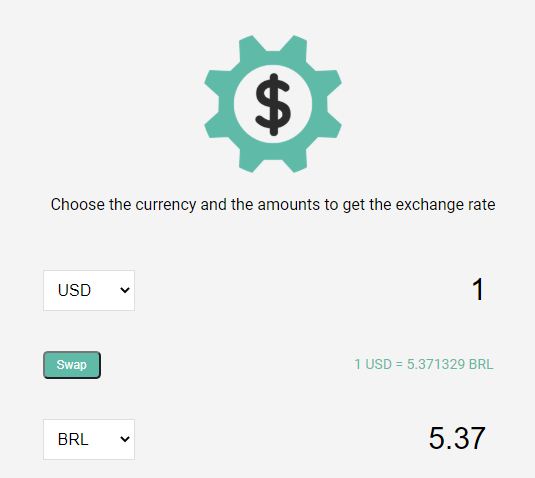

<!-- Título -->
<h1 align="center"> 
	:construction: Exchange Rate Calculator :construction:
</h1>

<!-- Gera uma imagem no centro do readme, dê preferência para usar SVG  -->
<h1 align="center">
    
</h1>

## 💻 Project

A small exchange rate calculator made with the ExchangeRateApi via fetch/JSON

<!-- Gera uma imagem no centro do readme, dê preferência para usar SVG  -->
<h1 align="center">
    
</h1>

Made with ♥ by Wallace Gomes :wave: [Get in touch!](https://www.linkedin.com/in/wallace-cardoso-gomes/)
